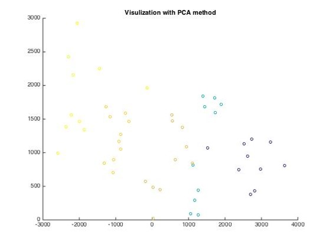
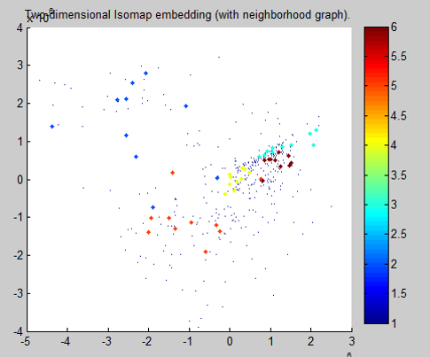

# README #

This README would normally document whatever steps are necessary to get your application up and running.

# What is this repository for? #

This is a implementation for the Eigenface algorithm introduce by the paper “Eigenface for recognition”. It is a really simple algorithm but our main contribution is to implement all the matrix calculation in C language include the multiply and inverse of matrix and our implementation is the fastest version in our class.

However, since the buffer size for each variable in Windows is restricted to about 2Mb, when we convert this version from Mac OS to Windows, it continues to prompt out errors. We finally find that the variable storing all the image data is empty since the variable is too large. This is a mac version.

# How to use #

1.	If you want to see the source code, you can enter source_code. 
2.	You can also compile the program and put the .exe

# Extension #

## Result of PCA in Eigenface ##

## Result of Isomap ##

